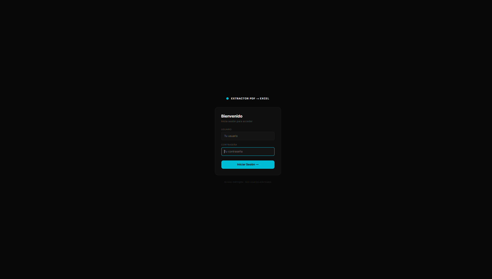
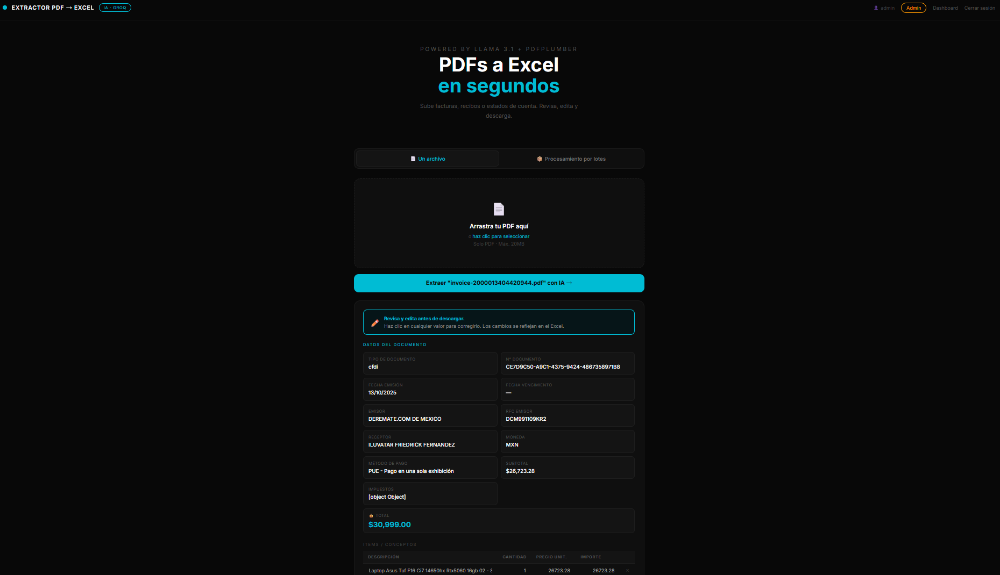
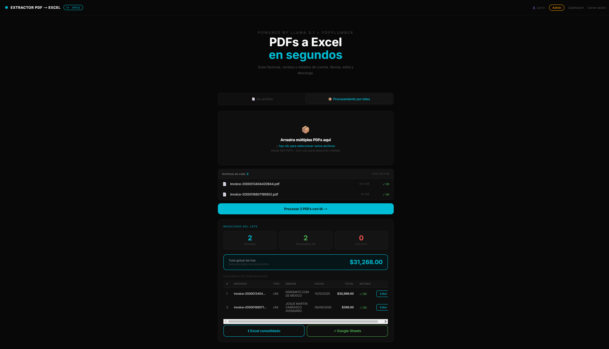
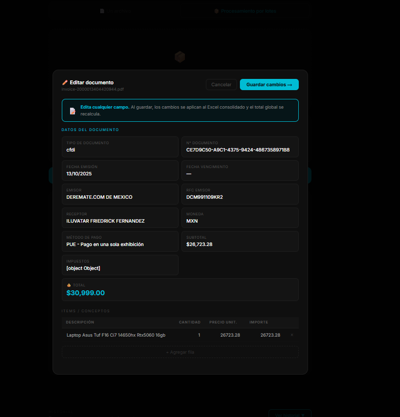
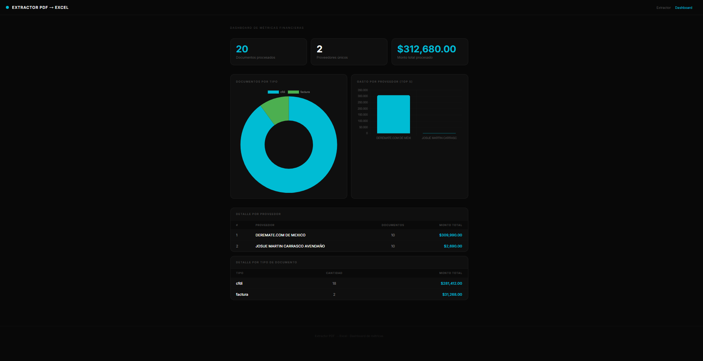

# 📄 Extractor de Datos PDF → Excel con IA

Aplicación web empresarial que permite a contadores y equipos financieros subir facturas, recibos y estados de cuenta en PDF y obtener automáticamente los datos estructurados en Excel o Google Sheets, con revisión humana antes de exportar.


---

## ✨ Funcionalidades

- **Extracción inteligente con IA** — Groq + LLaMA 3.1 detecta automáticamente el tipo de documento (CFDI mexicano, estado de cuenta, nómina, recibo de servicios, orden de compra, factura internacional) y extrae los datos clave con prompts especializados por tipo
- **Procesamiento por lotes** — sube hasta 500 PDFs de una sola vez con cola visual y procesamiento en secuencia
- **Revisión humana editable** — preview interactivo antes de descargar: todos los campos y la tabla de items son editables directamente en la interfaz, con botón para restaurar el original
- **Edición por lote con modal** — en modo lote, cada documento tiene un botón "Editar" que abre un modal completo para corregir datos antes de generar el Excel consolidado
- **Exportación a Excel** — archivo .xlsx profesional con hoja de resumen + hoja por documento, totales automáticos y formato de moneda
- **Exportación a Google Sheets** — manda los datos directo a una hoja compartida del equipo, con pestaña de resumen y pestañas individuales por documento
- **Historial con SQLite** — cada extracción se guarda automáticamente con búsqueda por proveedor o nombre de archivo y recarga de extracciones anteriores
- **Dashboard de métricas** — total procesado por proveedor, documentos por tipo, monto global acumulado y gráficas con Chart.js
- **Sistema de usuarios** — login seguro con Flask-Login y contraseñas encriptadas con Bcrypt, roles admin y usuario, panel de administración para gestionar cuentas

---

## 📸 Capturas

### Login


### Extractor individual con edición


### Procesamiento por lotes


### Modal de edición por documento


### Dashboard de métricas


### Panel de administración


---

## 🛠️ Stack tecnológico

| Capa | Tecnología |
|------|-----------|
| Backend | Python 3.10 + Flask |
| IA | Groq API + LLaMA 3.1 8B Instant |
| Extracción PDF | pdfplumber |
| Excel | Pandas + openpyxl |
| Google Sheets | gspread + google-auth |
| Auth | Flask-Login + Flask-Bcrypt |
| Base de datos | SQLite |
| Frontend | HTML + CSS + JavaScript vanilla |
| Gráficas | Chart.js (CDN) |
| Deploy | Railway / Gunicorn |

---

## 🚀 Instalación local

### Requisitos previos
- Python 3.10
- Miniconda o Anaconda
- Cuenta en [Groq Cloud](https://console.groq.com) para obtener tu API key
- (Opcional) Cuenta de Google Cloud para exportación a Sheets

### 1. Clona el repositorio

```bash
git clone https://github.com/Nihilus-code/extractor-pdf-excel.git
cd extractor-pdf-excel
```

### 2. Crea y activa el entorno Conda

```bash
conda create -n extractor_pdf python=3.10
conda activate extractor_pdf
```

### 3. Instala las dependencias

```bash
pip install -r requirements.txt
```

### 4. Configura las variables de entorno

Crea un archivo `.env` en la raíz del proyecto:

```env
GROQ_API_KEY=tu_api_key_de_groq_aqui
SECRET_KEY=una_clave_secreta_larga_y_random
UPLOAD_FOLDER=uploads
```

### 5. (Opcional) Configura Google Sheets

Si quieres usar la exportación a Google Sheets:

1. Crea un proyecto en [Google Cloud Console](https://console.cloud.google.com)
2. Activa las APIs de Google Sheets y Google Drive
3. Crea una cuenta de servicio y descarga el archivo JSON de credenciales
4. Renómbralo `google_credentials.json` y colócalo en la raíz del proyecto
5. Comparte tu hoja de Google Sheets con el `client_email` del archivo JSON como Editor

### 6. Ejecuta la aplicación

```bash
python -m flask run
```

Abre tu navegador en `http://127.0.0.1:5000`

### 7. Credenciales iniciales

Al iniciar por primera vez se crea automáticamente el usuario administrador:

```
Usuario: admin
Contraseña: admin1234
```

> ⚠️ Cambia la contraseña desde el Panel de Administración antes de usar en producción.

---

## 📁 Estructura del proyecto

```
extractor-pdf-excel/
│
├── app.py                        # Núcleo Flask — rutas y lógica principal
├── requirements.txt              # Dependencias del proyecto
├── .env                          # Variables de entorno (no incluido en repo)
├── google_credentials.json       # Credenciales Google (no incluido en repo)
│
├── modules/
│   ├── pdf_reader.py             # Extracción de texto con pdfplumber
│   ├── ai_extractor.py           # Detección de tipo + extracción con Groq
│   ├── excel_generator.py        # Generación de .xlsx con openpyxl
│   ├── sheets_exporter.py        # Exportación a Google Sheets
│   └── db_historial.py           # Historial SQLite + sistema de usuarios
│
├── templates/
│   ├── index.html                # Interfaz principal (extractor + historial)
│   ├── login.html                # Página de inicio de sesión
│   ├── dashboard.html            # Dashboard de métricas
│   └── admin.html                # Panel de administración
│
├── screenshots/                  # Capturas para el README
├── uploads/                      # PDFs subidos (ignorado por git)
└── data/                         # Base de datos SQLite (ignorado por git)
```

---

## 🔐 Sistema de autenticación

- **Admin** — acceso completo: extractor + dashboard + panel de administración
- **Usuario** — acceso al extractor y su historial personal

El admin crea las cuentas manualmente desde el panel. No hay registro público.

---

## 📊 Tipos de documentos soportados

| Tipo | Detección | Campos especializados |
|------|-----------|----------------------|
| CFDI Mexicano | ✅ Automática | UUID, RFC emisor/receptor, régimen fiscal, IVA |
| Estado de cuenta | ✅ Automática | Banco, CLABE, saldo inicial/final, movimientos |
| Nómina | ✅ Automática | Percepciones, deducciones, ISR, IMSS, neto |
| Recibo de servicios | ✅ Automática | Proveedor, número de contrato, período |
| Orden de compra | ✅ Automática | Número de orden, condiciones de pago |
| Factura internacional | ✅ Automática | Invoice number, due date, currency |
| Documento general | ✅ Fallback | Extracción genérica de campos comunes |

---

## 🔗 Proyectos relacionados

- [agente-ventas-ia](https://github.com/Nihilus-code/agente-ventas-ia) — Agente RAG de ventas con Flask, LangChain y ChromaDB
- [analizador-reportes-ia](https://github.com/Nihilus-code/analizador-reportes-ia) — Analizador de reportes Excel/CSV con insights en lenguaje natural

---

## 📄 Licencia

MIT License — libre para uso personal y comercial.

---

**Desarrollado por [Nihilus](https://github.com/Nihilus-code)**